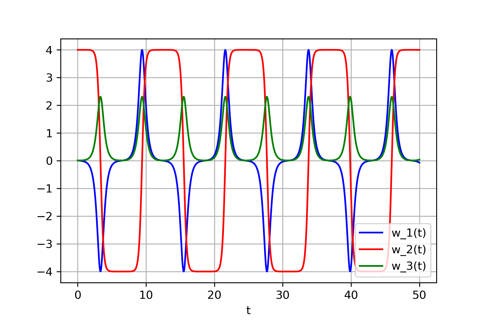

### Intermediate Axis Theorem

The intermediate axis theorem is an unintuitive concept in physics that occurs when a rigid object has incrementally larger moments of inertia for each of its orthogonal axes. When the object is spun around the axis with the intermediate moment of inertia, The direction of that axis oscillates.

Check out this video for a demonstration: [Dancing T-handle in zero-g](https://www.youtube.com/watch?v=1n-HMSCDYtM)

We can write the following differential equations for the system.

$I_{1}\dot\omega_{1} + (I_{3}-I_{2})\omega_{2}\omega_{3} = \tau_{1}$

$I_{2}\dot\omega_{2} + (I_{1}-I_{3})\omega_{1}\omega_{3} = \tau_{2}$

$I_{3}\dot\omega_{3} + (I_{2}-I_{1})\omega_{1}\omega_{2} = \tau_{3}$

In this scenario, $\tau_{1}$, $\tau_{2}$ and $\tau_{3}$ are all zero since no external torque is being applied. Assume $I_1 < I_2 < I_3$, $w_1 \approx 0$, $w_3 \approx 0$ and $w_2 \neq 0$. In order to compute solutions for this ordinary differential equation system numerically, the following python code snippet can be used.

```python
import numpy as np
import matplotlib.pyplot as plt
from scipy.integrate import odeint

def func(y, t, I1, I2, I3):
    omega_1, omega_2, omega_3 = y
    dydt = [(I2 - I3) * omega_2 * omega_3 / I1,
            (I3 - I1) * omega_1 * omega_3 / I2,
            (I1 - I2) * omega_1 * omega_2 / I3]
    return dydt

# Inertia
I1 = 1
I2 = 2
I3 = 3

t = np.linspace(0, 50, 1000)

y = [0.01, 4, 0.01] # Initial conditions

sol = odeint(func, y, t, args=(I1, I2, I3))

plt.plot(t, sol[:, 0], 'b', label='w_1(t)')
plt.plot(t, sol[:, 1], 'r', label='w_2(t)')
plt.plot(t, sol[:, 2], 'g', label='w_3(t)')
plt.legend(loc='lower right')
plt.xlabel('t')
plt.grid()
plt.show()
```

The numerical resolution of the differential equations indicates that $w_2$ oscillates between $-4$ and $4$. During the transition in axis direction, $w_1$ and $w_3$ briefly become non-zero for a very short duration.

